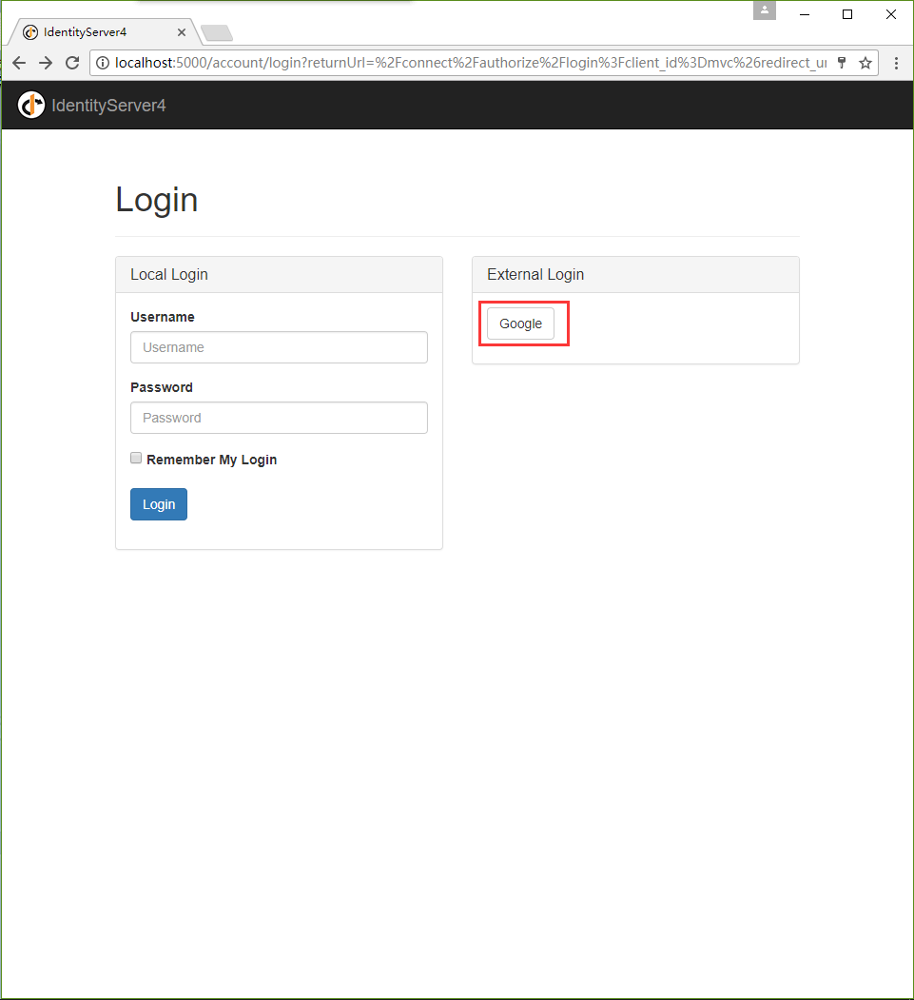

# IdentityServer4 中文文档 -12- （快速入门）添加外部认证支持

--------------------------------------------------------------------------

原文：http://docs.identityserver.io/en/release/quickstarts/4_external_authentication.html

上一篇：[IdentityServer4 中文文档 -11- （快速入门）添加基于 OpenID Connect 的用户认证](http://www.cnblogs.com/ideck/p/ids_quickstarts_11.html)
下一篇：[IdentityServer4 中文文档 -13- （快速入门）切换到混合流并添加 API 访问](http://www.cnblogs.com/ideck/p/ids_quickstarts_13.html)

接下来我们将添加外部认证支持。这真的很简单，因为你所需要的实际上只是一个 ASP.NET Core 兼容的认证中间件。

ASP.NET Core 自身已经承载了对 Google，Facebook，Twitter，Microsoft 账户 以及 OpenID Connect 的支持。另外你可以在 [这里](https://github.com/aspnet-contrib/AspNet.Security.OAuth.Providers) 找到更多其他的认证提供程序。

## 添加 Google 支持

为了能够使用 Google 进行身份验证，你首先需要对其进行注册。这应该是在开发人员[控制台](https://console.developers.google.com/)完成的。创建一个新项目，启用 Google+ API 并且通过添加 /signin-google 路径到你的基地址来配置你本地 IdentityServer 的回调地址（比如：[http://localhost:5000/signin-google](http://localhost:5000/signin-google)）。

如果你在 5000 端口上运行 IdentityServer - 那么你可以简单地从以下代码片段中使用客户端id/密码，因为这是我们预先注册的。

首先添加 Google 认证中间 NuGet 程序包到你的项目中（`Microsoft.AspNetCore.Authentcation.Google`）

然后我们要将中间件添加到管道中。**顺序很重要，额外的认证中间件必须在 IdentityServer 之后、MVC 之前运行**。

默认情况下我们会在幕后连接一个 cookie 中间件，这样的话外部认证就能够存储它的输出。你只需要将外部认证中间件添加到管道中，并让它使用 `IdentityServerConstants.ExternalCookieAuthenticationScheme` 登录方案：

```CSharp
app.UseGoogleAuthentication(new GoogleOptions
{
    AuthenticationScheme = "Google",
    DisplayName = "Google",
    SignInScheme = IdentityServerConstants.ExternalCookieAuthenticationScheme,

    ClientId = "434483408261-55tc8n0cs4ff1fe21ea8df2o443v2iuc.apps.googleusercontent.com",
    ClientSecret = "3gcoTrEDPPJ0ukn_aYYT6PWo"
});
```

> 注意：在 ASP.NET Core Identity 中使用外部认证的时候，`SignInScheme` 必须设置为 `Identity.External`，而不是 `IdentityServerConstants.ExternalCookieAuthenticationScheme`。

现在运行 MVC 客户端，然后尝试进行认证 - 你将在登录页面上看到一个 Google 按钮：



通过认证后，你可以看到现在的身份信息是由 Google 数据提供的了：


## 进一步实验

你可以添加额外的外部认证提供程序。我们有一个云托管的 IdentityServer4 示例版本，你可以通过 OpenID Connect 集成它。

首先添加 _`Microsoft.AspNetCore.Authentication.OpenID Connect`_ Nuget 程序包到你的 IdentityServer 项目中：


然后添加对应的中间件：

```CSharp
// 外部 OpenId Connect 认证中间件。
app.UseOpenIdConnectAuthentication(new OpenIdConnectOptions
{
    SignInScheme = IdentityServerConstants.ExternalCookieAuthenticationScheme,
    SignOutScheme = IdentityServerConstants.SignoutScheme,
    DisplayName = "开放链接",
    Authority = "https://demo.identiyserver.io/",
    ClientId = "implicit",

    TokenValidationParameters = new TokenValidationParameters
    {
        NameClaimType = "name",
        RoleClaimType = "role"
    }
});
```

> 注意：快速入门 UI 会自动提供外部用户。换句话说，如果一个外部用户第一次登陆进来，就会创建一个本地用户，所有外部身份信息都会被复制过来并与新的本地用户关联。处理这种情况的方法完全取决于你怎么想。也许你会想要首先显示某种用户注册页面。默认的快速入门源代码可以在 [这里](https://github.com/IdentityServer/IdentityServer4/blob/dev/src/Host/Quickstart/Account/AccountService.cs) 找到。


上一篇：[IdentityServer4 中文文档 -11- （快速入门）添加基于 OpenID Connect 的用户认证](http://www.cnblogs.com/ideck/p/ids_quickstarts_11.html)
下一篇：[IdentityServer4 中文文档 -13- （快速入门）切换到混合流并添加 API 访问](http://www.cnblogs.com/ideck/p/ids_quickstarts_13.html)
