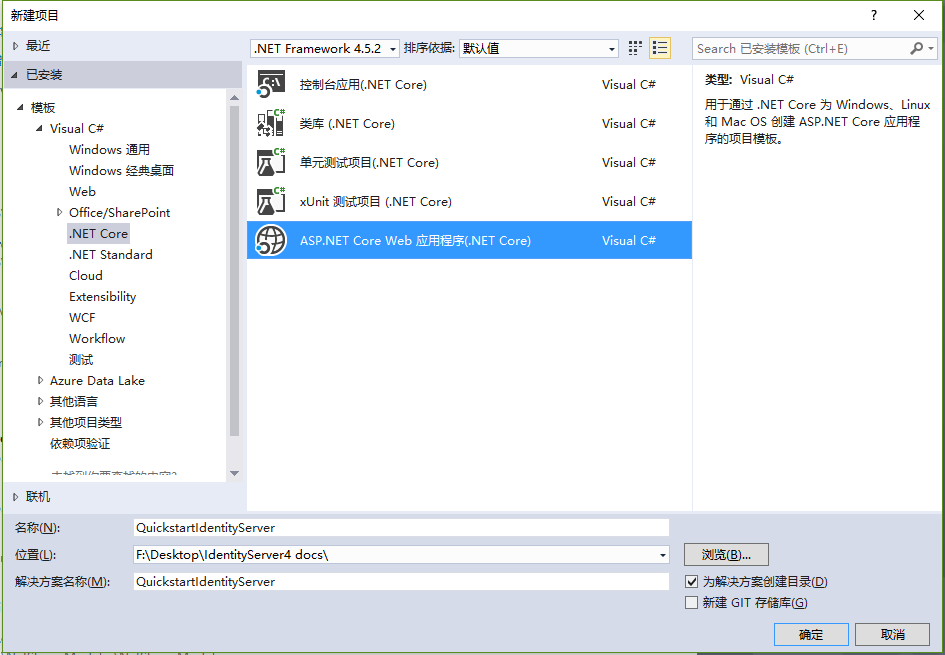
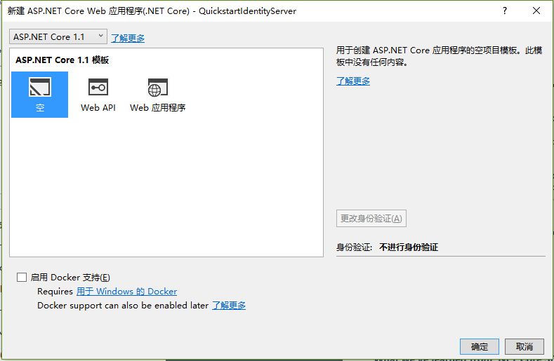
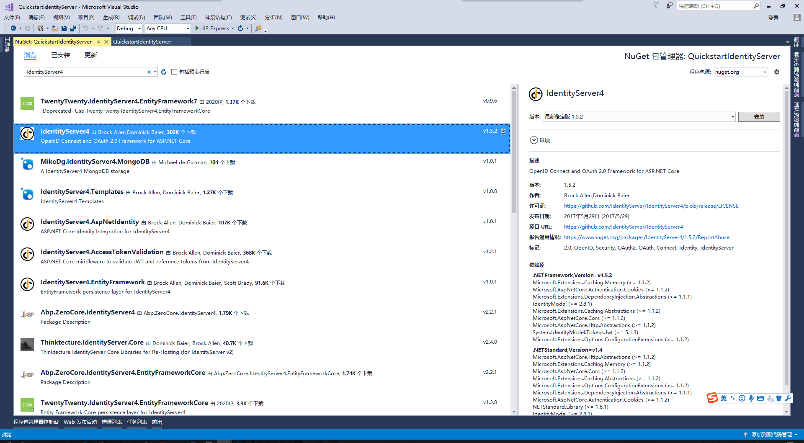
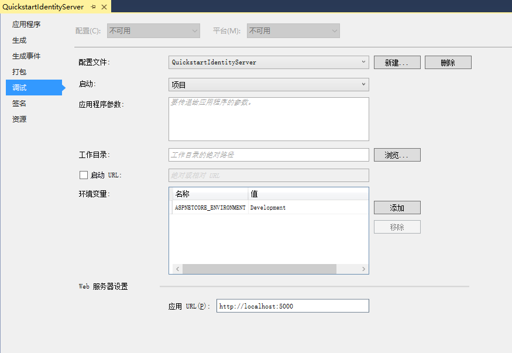
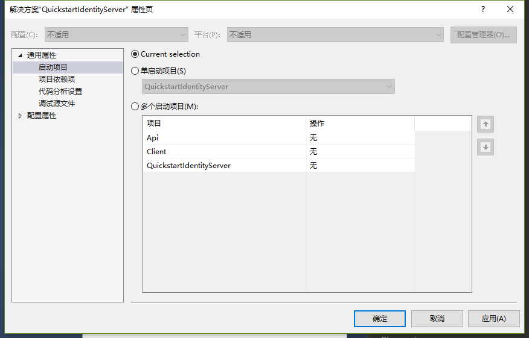

# IdentityServer4 中文文档 -8- （快速入门）设置和概览

---------------------------------------------------------------------

有两种基础方式可以开始一个新的 IdentityServer 项目：

* 从零开始
* 从 Visual Studio 中的 ASP.NET Identity 模板开始

如果你是从零开始，我们为你提供了一对帮助器和内存存储，所以你无需在一开始就担心持久化问题。

快速入门一步一步地介绍了各种常用的 IdentityServer 场景，它们从抽象基础开始，逐渐复杂 —— 所以建议你按顺序去完成它们。

每个快速入门都有对应的解决方案 —— 你可以在快速入门目录下的 [IdentityServer4.Samples](https://github.com/IdentityServer/IdentityServer4.Samples) 仓库中找到这些代码。

## 基础设置

屏幕快照显示的是 Visual Studio —— 但这不是必须的。

### 创建快速入门 IdentityServer

从创建一个新的 ASP.NET Core 项目开始。



然后选择 “空” 模板。



> 注意：IdentityServer 目前只支持 ASP.NET Core 1.1

然后是添加 IdentityServer4 的 nuget 程序包。



此外你还可以在 **程序包管理控制台** 中运行以下命令来添加这个依赖：

``` PowerShell
Install-Package IdentityServer4
```

IdentityServer 使用常规的模式来配置和添加服务到 ASP.NET Core 宿主。在 `ConfigureServices` 方法中,必要的服务会被配置和添加到 DI 系统。在 `Configure` 方法中，中间件会被添加到 HTTP 管道中。

像这样修改你的 `Startup.cs` 文件：

``` CSharp
public class Startup
{
    public void ConfigureServices(IServiceCollection services)
    {
        services.AddIdentityServer()
            .AddTemporarySigningCredential();
    }

    public void Configure(IApplicationBuilder app, ILoggerFactory loggerFactory)
    {
        loggerFactory.AddConsole(LogLevel.Debug);
        app.UseDeveloperExceptionPage();

        app.UseIdentityServer();
    }
}
```

`AddIdentityServer` 会将 IdentityServer 注册到 DI。他还会注册一个基于内存存储的运行时状态，这是对于开发场景来说是很有用的。对于生产环境你就需要像数据库或缓存这些持久化或共享存储部件。查看 [EntityFramework](http://docs.identityserver.io/en/release/quickstarts/8_entity_framework.html#refentityframeworkquickstart) 快速入门可以了解更多这方面的信息。

`AddTemporarySigningCredential` 扩展方法会在每次启动时为签名令牌创建临时的密钥材料。再次说明这对于入门是很有用的，但在生产环境下要用一些持久化密钥材料替换掉它。查看 [密码学文档](http://docs.identityserver.io/en/release/topics/crypto.html#refcrypto) 可了解更多这方面的信息。

> 注意：IdentityServer 还不能够启动。事实上当你尝试启动它时你应该会看到一个异常说缺少服务。我们将在接下来的快速入门中添加这些服务。

## 修改宿主

默认情况下 Visual Studio 使用 IIS Express 来挂载你的 Web 项目。这样做完全没问题，只是你将无法看到输出到控制台的实时日志信息。

IdentityServer 广泛使用了日志，而对于 UI 上可见的或返回给客户端的错误信息则有意模糊。

我们建议在控制台宿主上运行 IdentityServer3。你可以通过切换 Visual Studio 中的启动配置来实现，你甚至都无需在每次运行 IdentityServer 的时候都启动一个浏览器窗口 —— 你也可以用相同的方式关闭它：



当你切换到 自托管（self-hosting）的时候，Web 服务器端口默认就是 5000。你既可以通过上面对话框中的启动配置来修改它，也可以以编程的方式在 `Program.cs` 设置它 —— 在快速入门中，我们使用以下配置来设置 IdentityServer 宿主。

```CSharp
public class Program
{
    public static void Main(string[] args)
    {
        Console.Title = "IdentityServer";

        var host = new WebHostBuilder()
            .UseKestrel()
            .UseUrls("http://localhost:5000")
            .UseContentRoot(Directory.GetCurrentDirectory())
            .UseIISIntegration()
            .UseStartup<Startup>()
            .Build();

        host.Run();
    }
}
```

> 注意：我们建议将 IIS Express 和 自托管 配置为同一个端口。这样的话你可以自由地在两种模式下切换，无需关心和修改你客户端的任何配置。

## 如何运行快速入门

如前面所说，每个快速入门都会有对应的解决方案 ——  你可以在快速入门目录下的 [IdentityServer4.Samples](https://github.com/IdentityServer/IdentityServer4.Samples) 仓库中找到这些代码。

运行快速入门解决方案的个别部分最简单的方式是设置启动模式为“Current Selection”（当前选中）。右键点击解决方案并选择“设置启动项目”。



通常你首先要启动 IdentityServer，然后是 API，然后是 Client。只有在你想要调试的时候才在调试模式下运行，否则 Ctrl+F5 是运行项目的最佳方式。